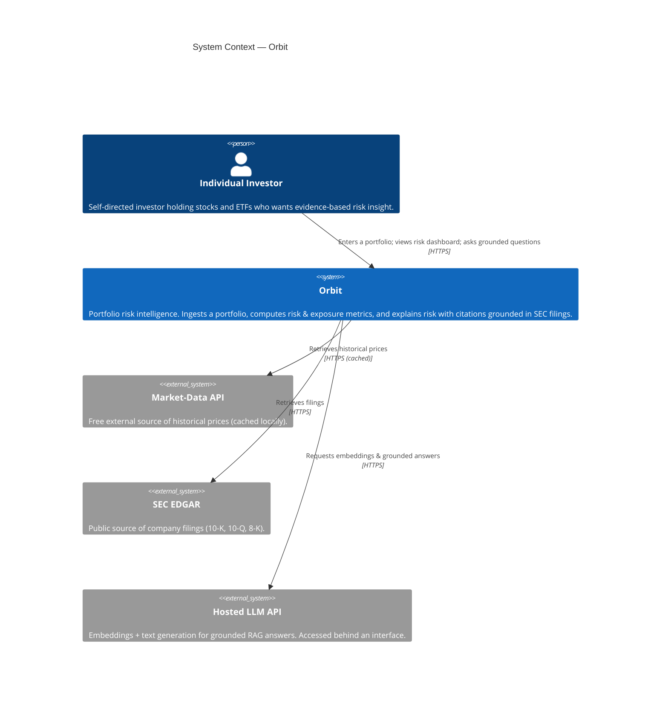
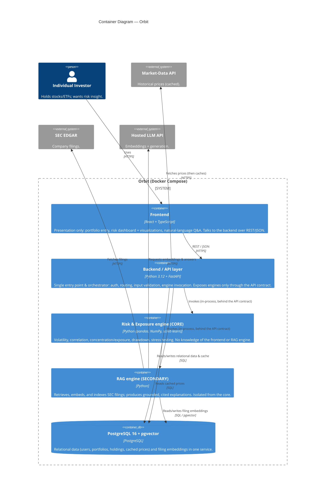

# Orbit — Architecture

This document describes Orbit's architecture using the [C4 model](https://c4model.com/).
Diagrams are kept as **Mermaid** in Markdown so they render natively on GitHub and stay
version-controlled as text. Keep these diagrams consistent with `README.md` §2 and with the
Architecture Decision Records in [`docs/adr/`](adr/). A stale diagram is worse than none — update
it whenever the architecture changes.

Currently maintained levels:

- **Level 1 — System Context:** Orbit as a black box among its users and external systems.
- **Level 2 — Container:** the deployable/runnable pieces inside Orbit and how they talk.

Level 3 (Component) diagrams are added only where the detail earns its place — most likely the
Risk & Exposure engine, since it is the graded algorithmic core.

---

## Level 1 — System Context

Who and what Orbit interacts with. Orbit measures, contextualizes, and explains portfolio
risk; it does **not** predict prices, execute trades, or give investment advice.

**Notes**

- All external data is free/public and used for academic purposes. All external calls and
  credentials stay server-side (see [ADR 0004](adr/0004-decoupled-engines-api-contract.md)).
- Market data is cached locally to respect free-tier rate limits (FR-6).

---

## Level 2 — Container

The runnable/deployable units inside the Orbit boundary. Everything inside the dashed boundary
runs as Docker Compose services (see [ADR 0003](adr/0003-docker-compose-provider-agnostic.md));
external systems and CI/CD sit outside it. The analytical engines are decoupled behind the API
contract (see [ADR 0004](adr/0004-decoupled-engines-api-contract.md)): the frontend and each
engine reach another engine **only** through the backend's API routes.

**Notes**

- **CI/CD (outside the boundary):** GitHub Actions builds and tests the container images on every
  push; the same images are what get deployed.
- **Engine boundary (US-15):** engines are components inside the backend process for the MVP, but
  callers reach them **only** through API routes — never by importing engine internals. This keeps
  the option open to promote an engine to its own service later without changing callers
  (a future ADR would record that move).
- **Data layer:** relational + vector data share one PostgreSQL service
  (see [ADR 0002](adr/0002-postgres-pgvector.md)).

---

## Level 3 — Component

Not yet maintained. When the Risk & Exposure engine grows enough internal structure to warrant it
(e.g. separate volatility, correlation, drawdown, and stress-testing components sharing a
market-data access layer), add a Level 3 component diagram for that engine here.

---

## Change log

- **2026-08-28** — Initial C4 Level 1 (System Context) and Level 2 (Container) diagrams created
  alongside the documentation scaffolding (Task 1).
